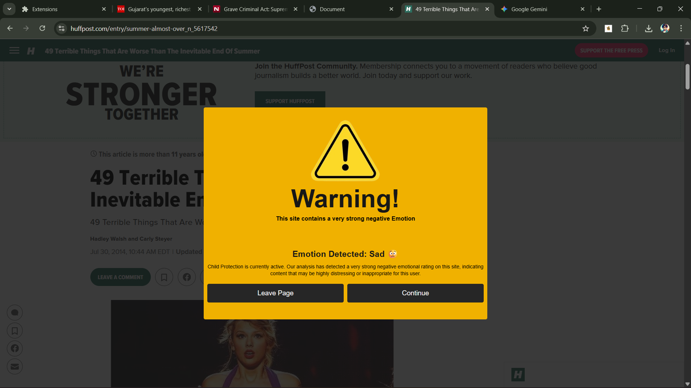

# 🤖VibeCheck: Real-Time Page Emotion Analyzer
VibeCheck is a high-performance, lightweight Chrome Extension designed to analyze the emotional **valence** (positivity/negativity) and **arousal** (intensity) of any active web page content. It maps the sentiment scores onto the Circumplex Model of Affect to provide rich, visual feedback to the user.

# 1. Architecture Overview (Manifest V3)
The project adheres strictly to the **Manifest V3** architecture, prioritizing speed, efficiency, and a small deployment footprint by running the core analysis logic within the **Service Worker**.

| Component | Technology | Role |
| --------- | ---------- | ---- |
| **Model** | LinearSVC with L1 Penalty (Python $\rightarrow$ ONNX) | Binary classification (Positive vs. Negative), chosen for extreme sparsity. Wrapped in CalibrateClassifierCV for probability value output with an accuray of over 88%|
| **Model Runtime** | ONNX Runtime (onnxjs) | Used in the Service Worker for fast, browser-native inference.|
| **Pre/Post-Processing** | preprocessor.js & postprocessor.js | Replicates Python's TF-IDF tokenization and converts raw probability scores to Circumplex V-A coordinates. |
| **Core Logic** | background.js (Service Worker) | Handles scraping, model loading, caching results per-tab, and orchestrating the entire ML pipeline. |
| **Visual Feedback** | Overlay.tsx (Content Script) | Injects the CSS animation (blinking gradient) or content-blocking overlay onto the inspected web page.|

# 2. Model Design and Optimization
The primary technical challenge was fitting a robust sentiment model into a small, performance-critical browser environment. This required specific choices during training and export.

## A. Training and Algorithm Choice
- **Algorithm:** `sklearn.svm.LinearSVC`
- **Penalty:** `penalty: 'l1'` and `dual=False`
- **Optimixation:** The **L1 penalty** was crucial because it forces the model to set the weights of most features (words) to exactly zero. This results in a highly sparse model, minimizing the size of the final ONNX artifact and maximizing prediction speed by only computing scores for a handful of impactful words.
- **Probability Scores:** The LinearSVC is wrapped in CalibratedClassifierCV(method='sigmoid') to enable reliable probability scores ($P_{\text{neg}}$, $P_{\text{pos}}$), which are necessary for the Valence/Arousal calculation

## B. Deployment Pipeline
1. **Vectorization Optimization:** The initial training vocabulary was filtered to approximately **50,000 top features** to limit the size of the final TF-IDF vectorizer object.
2. **ONNX Conversion:** The final $\text{Python Pipeline} (\text{TF-IDF} + \text{Classifier})$ is converted to the ONNX format using the skl2onnx library, providing a standardized, high-speed execution environment in JavaScript.

# 3. Circumplex Model Implementation
The core emotional state is derived from the model's output probabilities and mapped into the two-dimensional Valence-Arousal (V-A) space.

## A. Valence and Arousal Formulas
The emotionProcessor.js module calculates the core V-A coordinates using a linear transformation of the probabilities to ensure a clear, quantifiable spread across the emotional space:
- **Valence (V):** (Pleasantness/X-axis)
$$ V = P_{\text{pos}} - P_{\text{neg}} $$
$$ OR $$
$$ V = 2 * P_{\text{pos}} - 1 $$
- Range: $[-1 \text{ (Negative)}, +1 \text{ (Positive)}]$

- **Arousal (A):** (Intensity/Y-axis)
$$ A = P_{\text{pos}} + P_{\text{neg}} - 1 $$
- Range: $[-1 \text{ (Calm)}, +1 \text{ (Excited)}]$

$$ OR $$
$$ A = sin(PI * A) $$
- Range: [0,180deg]

# 4. Visual Feedback System
The content script is responsible for providing instantaneous, unambiguous in-page feedback based on the analysis, along with a detailed analysis in the Pop-up page of the extension

## A. Low-Intensity Feedback (Alert)
For most V-A states where the $\text{Magnitude} < +1.0$ and $\text{Valence} > -0.5$, the extension applies a subtle, animated border to the webpage.

<video width="800" mute controls>
  <source src="./assets/demo.mp4" type="video/mp4">
  Your browser does not support the video tag.
</video>


- **Color (Hue):** Directly controlled by Valence (Green for positive, Orange/Red for less positive) or custom selected colors for different Emotions.
## B. High-Intensity Feedback (Content Block)


If the calculated Valence is critically low (e.g., $V \le -0.5$), the extension triggers a content-blocking overlay. This feature is designed to prevent unintended exposure to potentially distressing or highly negative content, serving as a protective layer for the user.


## 5. Installation and Setup
### Prerequisites
- Node.js (v16+)
- npm or yarn
- A Chromium-based browser (Chrome, Edge, Brave)
### Local Development
1. **Clone Repository:**
```bash 
git clone https://github.com/BinayKumarLahiri/VibeCheck.git
cd VibeCheck
```
2. **Install Dependencies:**
```bash
npm install
or
yarn install
```
3. **Build the Extension (Vite/CRXJS):**
```bash
npm run build
```
4. **Load in Chrome:**
- Open Chrome and navigate to `chrome://extensions`
- Enable **Developer mode** (top right toggle)
- Click **Load unpacked**
- Select the generated `dist` folder.
